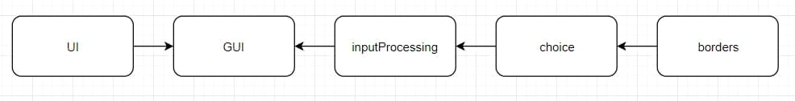

# User guide

### What is Imagine logo

Imagine logo is an entertainment program for creating 2D drawings by giving commands to a turtle.

### Getting started

To start using the program go to the `gui.py` file and run the code.

### Controlling turtle

To <u>move</u> the turtle use command `move [units]`. By default turtle faces north and there it will go. To <u>turn</u> the turtle clockwise use command `turn [angle]`. The turtle will now move in the direction you specified. By default, the turtle leaves a trail when it moves, to change this, <u>pick up</u> the turtle using command `up`. To <u>put</u> it <u>down</u> use command `down`.

### Menu

1. **File menu**

   **1.1 New**

   Returns everything to its original position. **Attention!** Make sure all changes are saved before creating a new file.

   **1.2 Open**

   Opens a text file with commands and executes them. **Attention!** All undefined commands will be skipped.

   **1.3 Save image**

   Opens a window for choosing a direction to save the image obtained while moving the turtle.

   **1.4 Save txt**

   Opens a window for choosing a direction to save commands in `.txt` format obtained while moving the turtle.

   **1.5 Exit**

   Closes the application. **Attention!** Make sure all changes are saved before closing the application.

### Example

An example of an image obtained entering the following commands:

`move 100`

`turn 90`

`move 100`

`turn 90`

`move 100`

`turn 90`

`move 100`

You can find more examples of the `.txt` files with commands in the `/examples/commands/` directory. Images obtained using these commands are located in the `/examples/imagex/` folder.

# Documentation

#### Technologies used:

Tkinter - package used to create program gui

- Pillow - library for handling images
- Math - module that provides access to the mathematical functions.
- Random - module that implements pseudo-random number.

### Modules

### <a name='gui'>`gui`</a>

The main program file. Initialization of the `MainWindow` class creates a `UI` class (from ui.py module) object responsible for the main program interface, creates turtle image and calls `createMenu` and `initialValues` methods. Calls `main` method when the command is entered.

`createMenu` method creates a `Menu` class object responsible for creating and managing top program menu.

`initialValues` method sets the initial values of the variables when the program starts.

`main` method creates a `InputProcessing` class (from [inputProcessing.py](#InputProcessing)) object responsible for processing the input.

### <a name='inputProcessing'>`inputProcessing`</a>

Module responsible for processing the input. If the input is correct, depending on it, creates an object of `Move` or `Turn` class (from [choice.py](#Logomocja_choice)). Shows an error if the input is incorrect.

### <a name='choice'>`choice`</a>

##### `Turn` class:

Initialized when the `turn` command is given. Rotates the image, sets the anchor.

##### `Move` class:

Initialized when the `move` command is given. Sets new coordinates of the image, moves it and draws a line if the turtle is down. Calls functions from `borders.py` module if canvas border is crossed while moving the image.

### Modules import system

